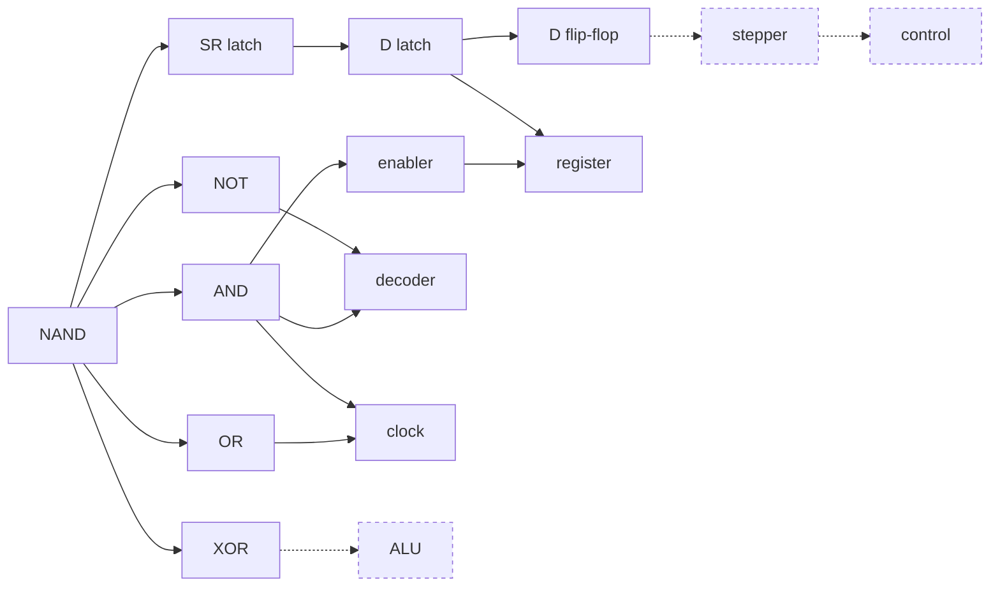

# NAND

A computer built up from a single primitive.

Every component here — inverters, adders, latches, registers, the clock — is composed
from one gate: `nand_t`. Nothing else is assumed. The project follows the machine in
*But How Do It Know?*: gates → enabler → register → decoder → ALU → control unit.



Solid edges are built and tested. Dashed ones are not there yet.

## Build

Needs CMake 3.16+ and a C++17 compiler.

```bash
git submodule update --init gtest
cmake -S . -B build
cmake --build build -j 8
cd build && ctest
```

92 tests, no warnings. On CMake 3.20+ the last line can be `ctest --test-dir build`.

## The interesting problem

The original design pushed signals along `std::function` callbacks: writing a gate
input evaluated the gate and drove its output wire immediately. It worked beautifully
for combinational logic and could not hold a single bit. `dgate.hpp` carried a note
saying feedback couldn't work in discrete mode, and the D latch was faked with a
`std::array<bool>` — which meant the register, and everything above it, was not
actually built from NAND.

Feedback turned out not to be the obstacle. The real defect was that `nand_t::in()`
**assigned an input and evaluated the gate in the same call**. A signal fanning out to
_k_ gate inputs therefore arrived one input at a time, and the circuit passed through
states that never exist in hardware. Combinational logic recovers from that — it still
settles on the right answer, which is exactly why every test passed. Memory does not:
a latch captures the transient and keeps it forever.

`circuit.hpp` fixes it by separating the two. `set()` only writes; nothing is evaluated
until `settle()` sweeps the netlist to a fixed point. Fan-out is applied atomically, so
feedback converges and a latch built from four NANDs holds its bit.

```cpp
circuit_t c;
auto d   = c.input(false);
auto clk = c.input(false);
auto q   = dff(c, d, clk);       // 9 NANDs

c.set(d, true);   c.settle();    // data stable before the edge
c.set(clk, true); c.settle();    // captured
```

Two details that cost a day each if you don't know them:

- **Sweeps are evaluated in place, not committed simultaneously.** A strictly
  simultaneous update agrees on well-behaved input but spins forever when an input
  changes in the same sweep as a clock edge — the cross-coupled pair flips in lockstep
  and never converges. Evaluating in place breaks the symmetry.
- **`settle()` returns the number of sweeps, and one sweep is one gate delay.** It
  returns `0` for a circuit that never converged, so a ring oscillator is a reported
  condition rather than a stack overflow. Treat `0` as a failure.

## The clock

`clk_t` generates one square wave plus the three signals derived from it:

```
phase           0     1     2     3
clk             _____|-----------|_____
clk_delayed     ___________|-----------|
clk_enable      _____|-----------------|
clk_set         ___________|-----|______
```

`clk_enable` rises first, so a source register is already driving the bus before
`clk_set` pulses and a destination captures; `clk_set` drops while the bus is still
driven. Without that stagger a register can latch a bus nothing is driving yet.

`clk_delayed` is a driven input rather than `clk` through a delay chain, because
`settle()` runs to a fixed point and erases combinational propagation delay — a chain
of inverters would settle to `clk` and the stagger would vanish. So the lag lives where
it survives: in the order the generator drives the two inputs.

## What's built

| Component | File | State |
| --- | --- | --- |
| `nand_t` — the primitive | `nand.hpp` | done |
| `not_t` `and_t` `or_t` `nor_t` `xor_t` `xnor_t` | `not.hpp` … `xnor.hpp` | done, tested at N = 2…64 |
| `enabler_t` | `enabler.hpp` | done |
| `decoder_t` — N to 2ᴺ | `decoder.hpp` | done, exhaustive to N = 4 |
| `dgate_t` — N gated D latches | `dgate.hpp` | done, 4 NANDs per bit |
| `registr_t` | `register.hpp` | done |
| `circuit_t` — netlist evaluator | `circuit.hpp` | done |
| `sr_latch` `dlatch` `dff` | `circuit.hpp` | done |
| `clk_t` — 4-phase clock | `clock.hpp` | done, 5 NANDs |
| `adder_t` | `adder.hpp` | **stub** — wrapper doesn't match `adder_1_t`, no carry chain, no tests |
| `alu_t` `cpu_t` `control_t` `ram_t` | `alu.hpp` … `ram.hpp` | empty shells |
| `stepper_t` `shift_register_t` `comparator_t` | `stepper.hpp` … | empty |

Two propagation models coexist during the migration. The older gates still use the
`wire_t` callback model, which is correct for combinational logic; anything holding
state is built on `circuit_t`.

## Tests

Assertions are on **settled values**, never on how many times a wire was driven. Call
counts are a by-product of how far a change happens to propagate — they say nothing
about whether the logic is right, and they break the moment the propagation model
changes. `probe_t` records what a wire last delivered, and the tests check that against
what the gate settled on:

```cpp
EXPECT_TRUE(nand.out());
EXPECT_TRUE(delivered(p, nand.out()));
```

The one exception is `wire_t` itself, where delivery count really is the contract.

Every non-trivial component has been checked with a negative control — break the
implementation, confirm the tests fail. Breaking the D latch's enable fails 19 tests;
removing the clock's stagger fails 3.

## Next

1. Move registers into a **shared** `circuit_t`. `dgate_t` currently owns a private one
   — a deliberate migration step that kept `registr_t` and its tests unchanged — while
   `clk_t` takes a reference. Until that's resolved, a register can't be clocked.
2. `stepper_t`: a ring counter of `dff`, driven by the clock. First thing that needs 1.
3. A real `adder_t` with a carry chain, then the ALU.
4. Control unit, then RAM.

## Layout

```
circuit.hpp     netlist evaluator, and the latches built on it
clock.hpp       clk_t and its derived signals
nand.hpp        the primitive
wire.hpp        callback fan-out used by the older gates
probe.hpp       test helper
*.cpp           tests for the header of the same name
gtest/          submodule, required
mos6502/        reference material, not built
nand2tetris/    reference material, not built
```

## Notes

`clk_t` is spelled that way because `<ctime>` already owns `clock_t`, the same dodge
`registr_t` makes around the `register` keyword.

Parts of the current design work — `circuit.hpp`, `clock.hpp`, the `dgate_t` rewrite,
the test rework — were done in collaboration with Claude (Opus 5); file headers record
which.

## License

© Gabriel Beauchemin. All rights reserved, per the source headers.
